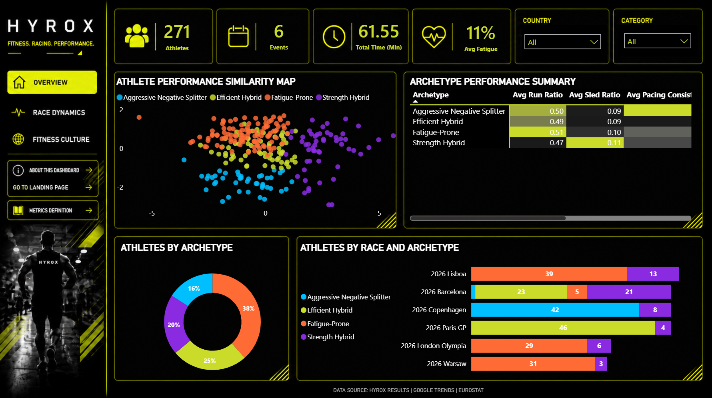
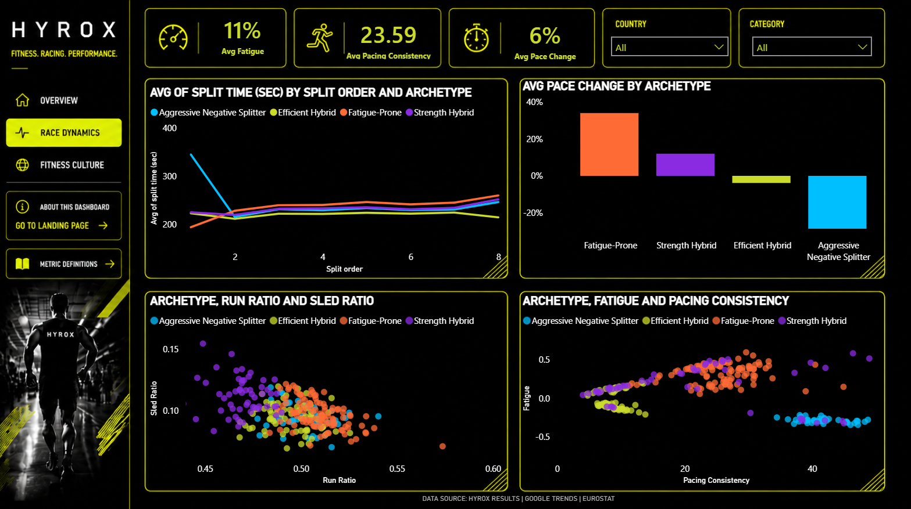
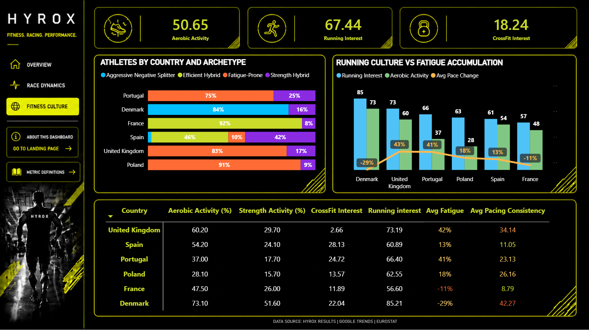

# HYROX Performance Analytics

An end-to-end data analytics project exploring athlete performance, pacing strategies and race dynamics in HYROX competitions.

The project combines automated data collection, relational data storage, Python-based analysis, athlete segmentation and interactive reporting in Power BI.

## Project Overview

The main goal of the project was to explore whether distinct athlete performance profiles can be identified based on race dynamics and pacing behaviour.

The analysis focused on male individual competitors in OPEN and PRO divisions across six European HYROX events:

- Warsaw, Poland
- Lisboa, Portugal
- Barcelona, Spain
- London, United Kingdom
- Paris, France
- Copenhagen, Denmark

The project also included an exploratory country-level analysis using external fitness indicators from Eurostat and Google Trends.

## Data Pipeline

The project covers the full analytics workflow:

**HYROX Results → n8n → PostgreSQL / Supabase → Python / Marimo → K-Means & PCA → Power BI**

### Data Collection

Race results and split-level performance data were collected from HYROX Results using an automated n8n workflow.

The workflow retrieved event results and detailed race splits and loaded them into a relational PostgreSQL database hosted in Supabase.

### Data Analysis

Data preparation and analysis were performed in Python using Marimo.

The analysis included:

- data cleaning and validation
- feature engineering
- race split analysis
- pacing analysis
- athlete segmentation
- country-level comparisons
- integration of external data sources

Several performance metrics were created, including:

- **Pace Change** – change between the first and final running split
- **Pacing Variability** – variability across running splits
- **Run Ratio** – share of race time spent running
- **Station Ratio** – share of race time spent on workout stations
- **Station-specific ratios** – metrics describing selected workout contributions to total race time

## Athlete Archetypes

K-Means clustering was used to identify four athlete performance archetypes based on pacing and race characteristics:

- **Fatigue-Prone**
- **Efficient Hybrid**
- **Strength Hybrid**
- **Aggressive Negative Splitter**

PCA was used to reduce dimensionality and visualize similarities between athlete profiles.

## Key Findings

The analysis revealed clear differences in pacing behaviour between the identified athlete archetypes.

- **Fatigue-Prone** athletes showed the highest Pace Change and the strongest deterioration in pace towards the end of the race.
- **Aggressive Negative Splitters** recorded the lowest Pace Change and the lowest pacing variability.
- The largest differences between archetypes appeared at the beginning and towards the end of the race, while pacing during the middle section was more similar.
- Country-level analysis suggested that higher aerobic activity may be associated with different pacing profiles, although these relationships remain exploratory.

## Dashboard

The final Power BI dashboard consists of three main analytical sections.

### Overview



Provides an overview of athlete performance, archetype distribution and similarities between athlete profiles.

### Race Dynamics



Explores running split progression, Pace Change and differences in pacing strategies between athlete archetypes.

### Fitness Culture



Combines HYROX performance data with country-level indicators from Eurostat and Google Trends to explore potential relationships between fitness culture and race performance.

## Interactive Dashboard

👉 **[Explore the interactive Power BI dashboard](https://app.powerbi.com/view?r=eyJrIjoiMjMxMjY3MmEtYjA5OC00MGNlLTljYWQtZThlNDBhOTFlMGY3IiwidCI6IjNkZmU5YWI2LTgxYmYtNDkxYy1iNjcwLTAxYzgyNGEwOWUxOSJ9)**

## Technologies

- **n8n** – automated data collection
- **PostgreSQL / Supabase** – relational data storage
- **Python** – data analysis and feature engineering
- **Marimo** – interactive Python notebook
- **pandas / NumPy** – data preparation and transformation
- **scikit-learn** – K-Means clustering, StandardScaler and PCA
- **Power BI** – dashboard development and data visualization

## Data Sources

- **HYROX Results** – race results and split-level performance data
- **Eurostat** – country-level physical activity indicators
- **Google Trends** – search interest in HYROX, running and CrossFit

Raw athlete-level data is not included in this repository.

## Repository Structure

```text
hyrox-performance-analysis/
│
├── analysis/
│   └── hyrox_analysis.py
│
├── dashboard/
│   ├── overview.png
│   ├── race_dynamics.png
│   └── fitness_culture.png
│
├── n8n/
│   └── hyrox_workflow.json
│
├── .gitignore
└── README.md
```

## Limitations

- The analysis covers six HYROX events across six countries.
- The scope is limited to male individual competitors in OPEN and PRO divisions.
- Google Trends reflects search interest rather than actual sports participation.
- Eurostat and Google Trends indicators are aggregated at country level rather than athlete level.
- Country-level relationships are exploratory and should not be interpreted as causal.

## Author

**Natalia Dzwonkowska**

Postgraduate project completed as part of the **AI Analyst 5.0** program.
